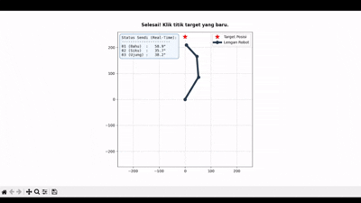

# 🤖 Praktikum Kinematika: Jacobian-Based IK untuk Redundant Manipulator

Repositori ini berisi modul praktikum **Inverse Kinematics (IK)** menggunakan metode numerik **Jacobian Pseudo-inverse** untuk lengan robot planar 3-DOF. 

Berbeda dengan sistem robot standar, modul ini mendemonstrasikan konsep **Robot Redundan**. Karena robot memiliki 3 sendi (3-DOF) namun targetnya hanya mempedulikan 2 sumbu koordinat (X dan Y), robot memiliki derajat kebebasan ekstra. Ini memungkinkan robot bergerak luwes mencari posisi target tanpa dibatasi oleh orientasi ujung lengannya.

---

## 📸 Demo Visualisasi



> **Keterangan:** Lengan robot 3-DOF secara dinamis menghitung matriks Jacobian untuk mengejar titik target (bintang merah) yang diklik oleh pengguna secara *real-time*.

---

## 🧮 Landasan Matematika

### 1. Forward Kinematics (FK)
Posisi ujung lengan $(x, y)$ dihitung berdasarkan sudut ketiga sendi $(q_1, q_2, q_3)$:
* $x = L_1 \cos(q_1) + L_2 \cos(q_1 + q_2) + L_3 \cos(q_1 + q_2 + q_3)$
* $y = L_1 \sin(q_1) + L_2 \sin(q_1 + q_2) + L_3 \sin(q_1 + q_2 + q_3)$

### 2. Matriks Jacobian Redundan (2x3)
Karena orientasi diabaikan, matriks Jacobian direduksi menjadi matriks $2 \times 3$. Matriks ini memetakan kecepatan dari 3 sendi input ke kecepatan 2 sumbu output:

$$
J = \begin{bmatrix} \frac{\partial x}{\partial q_1} & \frac{\partial x}{\partial q_2} & \frac{\partial x}{\partial q_3} \\ \frac{\partial y}{\partial q_1} & \frac{\partial y}{\partial q_2} & \frac{\partial y}{\partial q_3} \end{bmatrix}
$$

### 3. Iterasi Inverse Kinematics
Pembaruan sudut dilakukan secara iteratif menggunakan **Moore-Penrose Pseudo-inverse** ($J^{\dagger}$). Langkah kecil ($\alpha$) digunakan untuk mencegah *overshoot* akibat pergerakan lengan yang bersifat non-linear:

$$
\Delta q = \alpha \cdot J^{\dagger} \cdot (X_{target} - X_{current})
$$

---
### 📌 Penjelasan Variabel Parameter

Untuk mempermudah pemahaman sinkronisasi antara rumus dan kode program, berikut adalah rincian dari setiap simbol yang digunakan:

**1. Dimensi Fisik & Koordinat (Task Space)**
* **$L_1, L_2, L_3$**: Konstanta panjang fisik dari setiap segmen lengan robot (Bahu, Siku, Pergelangan).
* **$X_{target}$**: Vektor koordinat $[x, y]$ tujuan akhir yang ingin dicapai.
* **$X_{current}$**: Vektor koordinat $[x, y]$ posisi ujung lengan (*end-effector*) saat ini.

**2. Variabel Sendi (Joint Space)**
* **$q_1, q_2, q_3$**: Sudut rotasi saat ini pada masing-masing engsel (dalam radian). Sudut diukur secara relatif terhadap segmen sebelumnya.
* **$\Delta q$**: Perubahan sudut yang harus diaplikasikan ke motor engsel agar lengan bergerak menuju target (Output dari algoritma IK).

**3. Komponen Jacobian & Kontrol Iterasi**
* **$J$**: Matriks *Translational Jacobian* berukuran $2 \times 3$. Matriks ini menerjemahkan sensitivitas pergerakan sendi terhadap pergerakan ujung lengan di bidang 2D.
* **$\frac{\partial x}{\partial q_1}$**: Turunan parsial. Secara fisik berarti: *"Seberapa jauh ujung lengan bergeser di sumbu X jika hanya sendi 1 yang diputar?"*
* **$J^{\dagger}$**: *Moore-Penrose Pseudo-inverse* dari matriks $J$. Berfungsi sebagai pembalik (invers) matriks non-persegi agar sistem redundan tetap bisa diselesaikan.
* **$\alpha$**: *Step size* (Kecepatan konvergensi). Merupakan faktor pengali kecil (contoh: 0.1) yang memaksa robot bergerak selangkah demi selangkah. Ini mencegah *overshoot* karena matriks Jacobian hanya akurat memprediksi jarak yang sangat pendek.

## 🚀 Cara Menjalankan Simulasi

**1. Persiapan Kebutuhan**
Pastikan Anda menggunakan Python 3.x dan telah menginstal *library* komputasi numerik dan plotting:
```bash
pip install numpy matplotlib
